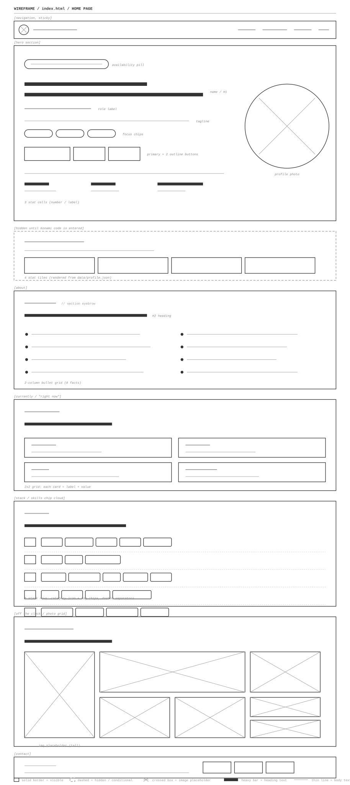
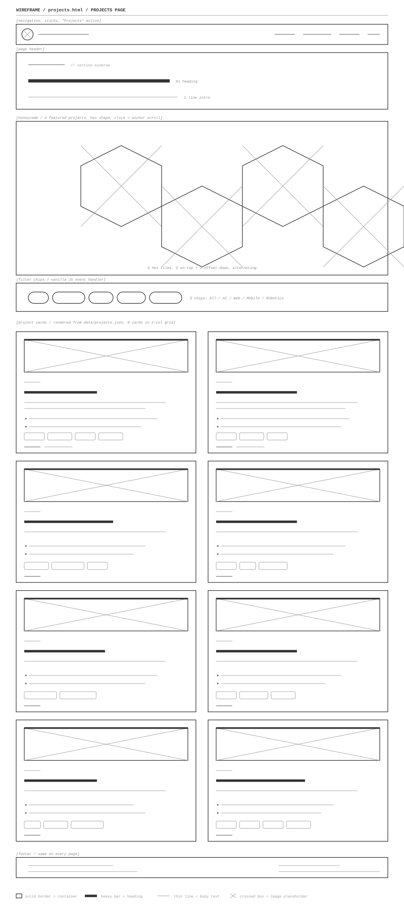
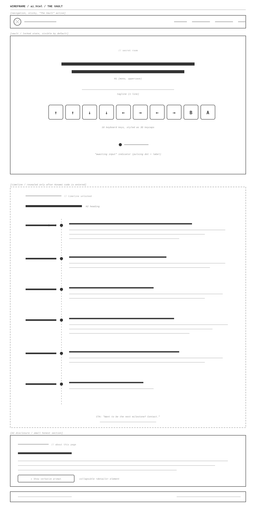

# Design Document

**Author:** Harini Thirunavukkarasan
**Course:** CS5610 Web Development, Summer 2026, Northeastern University
**Project:** Project 1, Personal Homepage

---

## 1. Project Description

A personal homepage and portfolio for Harini Thirunavukkarasan: software engineer with 2.5 years at Wells Fargo, now in the MS CS program at Northeastern.

It is a front-end-only static site, built with vanilla HTML5, CSS3, and ES6 modules on top of Bootstrap 5.

Three pages:

1. `index.html` (Home). Hero, About, Currently, Stack, Off the clock, Contact. Hand-authored.
2. `projects.html`. Honeycomb of 4 featured tiles plus 8 detail cards. Hand-authored.
3. `ai.html` (The Vault). Locked Konami hero, hand-authored. Press the Konami code to reveal a career timeline. Small AI-disclosure section at the bottom (timeline copy was drafted by Claude Sonnet 4.6 and hand-edited; verbatim prompt is published on the page).

Deployed on GitHub Pages. MIT licensed.

### Visual theme

Pacman-inspired: deep navy-black background, mellowed Pacman yellow primary, Pinky-ghost pink and Inky cyan as secondary accents. JetBrains Mono for accent labels, Inter for body. No white background anywhere.

### Goals

- A recruiter scanning for 30 seconds finds: name, program, top skills, link to projects, link to contact.
- A developer reading the source finds: clean folder structure, semantic HTML, modular JS, accessible markup, lint-clean code.
- One memorable interactive feature (the Vault, see Section 5) that differentiates the site without sacrificing professionalism.

### Non-goals

- Not a CMS, blog engine, or backend application.
- Not a complete project archive. Eight projects are featured, not every commit ever shipped.

---

## 2. User Personas

### Priya, Tech Recruiter

Looking for Summer 2027 SWE internship and co-op candidates. Reviews 50 to 100 portfolios a day. Has 20 to 40 seconds per site before deciding to bookmark.

Cares about: clear name and program above the fold, recent project evidence, easy access to resume and contact.
Hates: portfolios that hide the basics behind animations or chrome.

### Marcus, Senior Engineer / Open-Source Collaborator

Mid-career engineer who follows a link from a mutual contact. Will scroll, will read the README, will open the GitHub repo for the site itself.

Cares about: code organization, naming, accessibility, whether the site was thoughtfully scoped or over-engineered.
Hates: portfolios that look great but whose source is a mess, or where everything was clearly AI-generated.

### Sam, Fellow CS5610 Classmate (Peer Reviewer)

Assigned to peer-review the project. Has the rubric open in one window and the site in another. 24 hours to complete.

Cares about: rubric criteria visibly met (ES6 modules, Bootstrap grid, vanilla JS feature, creative addition, accessibility, README sections).
Hates: missing rubric items, unclear creative additions, broken demo videos.

---

## 3. User Stories

### Story 1: Priya bookmarks or moves on

Priya opens the homepage at her desk on a Thursday afternoon, fifth in a list of 40 candidate links. Within five seconds she needs Harini's name, program, top three skill areas, and a link to projects.

**As a tech recruiter, I want** to land on the homepage and immediately see name, program, skill chips, and links to projects + GitHub + LinkedIn, **so that** I can decide in under 30 seconds whether to add the candidate to my pipeline.

Acceptance:

- Above the fold on a 1440x900 viewport: name, headline, focus chips, at least one CTA.
- Nav visible without scrolling.
- Responsive, looks fine on phone.

### Story 2: Marcus evaluates code quality

Marcus has fifteen minutes between meetings. Skims the home page, opens the GitHub repo, looks at the folder structure, opens a JS file, runs `npm run lint`, checks the README.

**As a senior engineer, I want** the site source to be cleanly organized, lint-clean, well-documented, and free of unnecessary dependencies, **so that** I can trust this developer to ship maintainable code on a real team.

Acceptance:

- CSS, JS, images, and data live in clearly named folders.
- README answers: what is this, how do I run it, what is the creative addition, what AI tools were used.
- `npm run lint` passes with zero errors using the class ESLint config.
- No jQuery, no React or Vue. Vanilla JS only.

### Story 3: Sam finds the creative addition

Sam has the rubric open in one window and Harini's site in another. They need to check off "original creative component" without playing hide-and-seek.

**As a peer reviewer, I want** the creative addition to be obviously discoverable, **so that** I can credit it during the rubric review.

Acceptance:

- Discoverable from the main navigation (the "Vault" page).
- The locked vault hero displays the exact key sequence on screen, so the reviewer cannot miss what to do.
- Named in the README under a section titled "Creative Addition".
- Works without console errors in Chrome and Safari on a fresh page load.

---

## 4. Wireframes

Blueprint-style wireframes for each page. Solid borders are visible containers, dashed borders mark hidden or conditional states, crossed boxes are image placeholders, heavy bars are headings, thin lines are body text.

Each wireframe is a standalone SVG and can be opened directly:

| Page      | File                                               |
| --------- | -------------------------------------------------- |
| Home      | [wireframes/home.svg](wireframes/home.svg)         |
| Projects  | [wireframes/projects.svg](wireframes/projects.svg) |
| The Vault | [wireframes/vault.svg](wireframes/vault.svg)       |

### 4.1 Home (`index.html`)

Top to bottom:

- **Navbar** (sticky): avatar, name, four nav links.
- **Hero**: two columns. Left column has an availability pill, large H1 name, role label, tagline, three focus chips, primary + outline CTAs, and a 3-stat row. Right column is a circular profile photo.
- **About**: 2-column bullet grid of 8 facts (work history, education, awards, certifications).
- **Currently**: 2x2 grid of cards (shipping / open to / into / side quest).
- **Stack**: 5 rows of category icon + tech chips, separated by dashed lines.
- **Off the clock**: masonry photo grid (1 tall, 1 wide, 5 standard).
- **Contact**: tagline + 3 buttons.
- **Footer**: copyright on the left, source + license on the right.

### 4.2 Projects (`projects.html`)

- **Navbar** (with "Projects" active).
- **Page header**: eyebrow, H1, 1-line intro.
- **Honeycomb**: 4 hexagonal tiles for the featured projects, arranged in a 2-on-top + 2-offset-down pattern. Each hex links to the corresponding detail card below via an `#project-{id}` anchor.
- **Filter chips**: 5 buttons (All, AI/ML, Web, Mobile, Robotics) wired up by a vanilla JS event handler.
- **Cards grid**: 2 columns x 4 rows of project cards. Each card has a Pacman-themed maze thumbnail with a per-project accent stripe, year, title, tagline, 2-3 highlight bullets, stack chips, and GitHub + Demo links.
- **Footer**.

Cards render dynamically from `data/projects.json` via [js/projects.js](js/projects.js).

### 4.3 The Vault (`ai.html`)

- **Navbar** (with "The Vault" active).
- **Vault hero** (locked state, visible by default):
  - Eyebrow `// secret room`.
  - Large mono H1: "Press the Konami code".
  - 1-line tagline.
  - 10 keyboard-style key buttons displayed in a row: arrows + B + A.
  - "Awaiting input" indicator with a pulsing dot.
- **Career timeline** (hidden by default, revealed only after the Konami code is entered):
  - Eyebrow + H2.
  - 6 vertical timeline entries connected by a dotted line of yellow pellets. Each entry has a year, heading, and a 1-3 sentence description.
  - CTA at the bottom: "Want to be the next milestone?".
- **AI disclosure** (small section at the bottom): eyebrow + H2 + 1 short paragraph + a collapsible `
` element containing the verbatim prompt used to draft the timeline copy.
- **Footer**.

---

## 5. Creative Addition: The Vault (Konami code)

The headline interactive feature lives on the third page (`ai.html`), branded as "The Vault".

The page presents as a locked hero with the exact Konami sequence (`Up Up Down Down Left Right Left Right B A`) displayed on screen as styled keyboard keys, plus a pulsing "awaiting input" indicator. Pressing the sequence:

1. A `keydown` listener tracks the last 10 key codes (rolling buffer).
2. On match, toggles a `dev-mode` class on `<body>` and fires a `devmodechange` custom event.
3. The vault hero dims (still visible, but recedes), and a **career timeline** of 6 milestones slides in below: 2019, 2022, 2023, 2024, 2025, 2026.
4. Each milestone is a year + heading + 1-3 sentence description, connected by a dotted line of yellow Pacman pellets.
5. Re-entering the sequence toggles the timeline off and restores the locked hero.

Why it works:

- Obvious to peer reviewers: the keys are printed right on the page, no easter-egg guessing.
- Still surprising for everyone else: the locked-vault aesthetic teases payoff without spoiling it.
- On-brand with the Pacman visual theme.
- Comfortably exceeds the rubric's "original JS feature, more than 5 lines" bar.
- Accessibility-safe: keyboard nav still works, `aria-live="polite"` on the vault section announces the reveal to screen readers, the keys are wrapped in semantic `<kbd>` elements.

The listener is gated on the presence of a `[data-konami-target]` element. Home and Projects pages do not have it, so pressing the sequence there is a no-op (no dead keystrokes or accidental theme flips).

Implementation lives in:

- [js/konami.js](js/konami.js) (rolling keydown buffer, body class toggle, custom event dispatch)
- [ai.html](ai.html) (locked vault markup + timeline markup with `konami-reveal` class)
- The `.vault`, `.timeline`, and `body.dev-mode` blocks at the bottom of [css/styles.css](css/styles.css)

---

## 6. Decisions and Open Items

### Decided

- [x] Creative addition: Konami-revealed career timeline on `ai.html` (The Vault).
- [x] GenAI usage: Claude Sonnet 4.6 drafted timeline descriptions, then hand-edited. Verbatim prompt published on the page.
- [x] Featured projects: 4 in the honeycomb (SHEild, Priceless, RAG Portfolio, Flutter Apps). 8 total detail cards (adds Codon: Prodgard, Release Version Tool, Hexapedal Bot, BERT NLP Chatbot).
- [x] Grid: Bootstrap 5.
- [x] Visual theme: Pacman-inspired, deep navy-black + Pacman yellow + Pinky pink.
- [x] Deployment: GitHub Pages.
- [x] License: MIT.

### Open

- [x] Deploy to GitHub Pages and paste the URL in README. Live at https://harini0-0.github.io/Project-1-HomePage/
- [x] Record and upload the 3-minute demo video. https://youtu.be/etV1DWWPiEs
- [x] Create and share the 2-minute presentation deck. https://drive.google.com/file/d/1qYVa9uyjLkTrAhYW8N_cbuelmBYCH346/view?usp=share_link
- [ ] Save profile photo at `images/profile.jpg`.
- [ ] Save project cover screenshots at `images/projects/{sheild,priceless,rag-portfolio,flutter-apps,codon-prodgard,release-version-tool,hexapedal-bot,bert-chatbot}.png`.
- [ ] Save seven hobby photos at `images/hobbies/`.
- [ ] Save a home-page screenshot at `images/screenshot-home.png` and uncomment the line in README.
- [ ] Update per-project GitHub URLs in `data/projects.json` (currently all point to profile root).
- [ ] Verify the "Currently" copy on the home page reflects actual current status.
- [ ] Validate the deployed site at https://validator.w3.org and fix any errors.
- [ ] Submit Canvas Google Form with all three URLs.
- [ ] Optional: theme toggle in the navbar.

---

## 7. References

Two prior CS5610 student homepages reviewed during design:

- Julia Weppler: [julia-weppler-1.github.io/cs5610-project1-homepage](https://julia-weppler-1.github.io/cs5610-project1-homepage/). Three pages, "shuffle cards" interactive element.
- Xinhao Chen: [xaiz096.github.io/Personal-Web/about.html](https://xaiz096.github.io/Personal-Web/about.html). Three pages, front-end-only contact form, theme switcher.

Lesson applied: each used one strong interactive feature as the creative addition, not scattered flourishes. This design follows the same principle, with the Vault as the single headline interaction.
