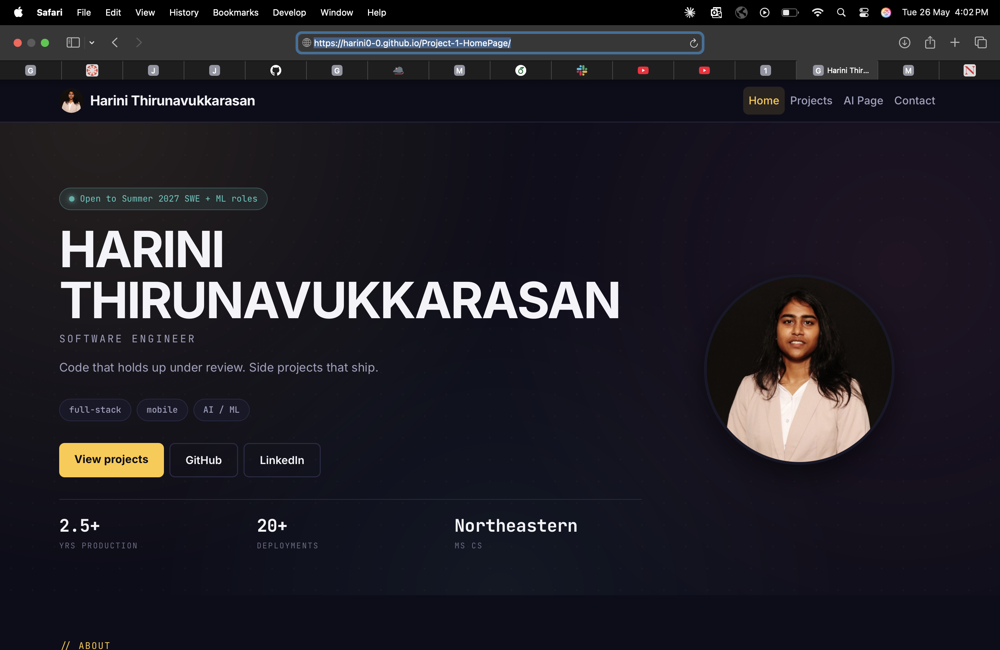

# Project-1-HomePage

Personal homepage for **Harini Thirunavukkarasan**. Project 1 for [CS5610 Web Development](https://northeastern.instructure.com/courses/229089), Northeastern University, Summer 2026.

Vanilla HTML5, CSS3, ES6 modules. Bootstrap 5 for grid. No framework, no jQuery, no build step.

## Live site

**[harini0-0.github.io/Project-1-HomePage](https://harini0-0.github.io/Project-1-HomePage/)**

## Demo video

[](https://youtu.be/etV1DWWPiEs)

[youtu.be/etV1DWWPiEs](https://youtu.be/etV1DWWPiEs)

## Slides

[2-minute presentation deck (Google Drive)](https://drive.google.com/file/d/1qYVa9uyjLkTrAhYW8N_cbuelmBYCH346/view?usp=share_link)

## Screenshot



> Save your home-page screenshot at `images/screenshot-home.png` for this image to render. macOS: ⇧⌘5, capture the browser window, then move the file into the repo.

## What is in here

Three pages:

1. `index.html` (Home). Hero, About, Currently, Stack, Off the clock, Contact. Hand-authored.
2. `projects.html`. Honeycomb of 4 featured tiles, plus 8 detail cards. Hand-authored.
3. `ai.html` (The Vault). Locked hero with the Konami sequence printed on screen. Press the sequence to reveal a 6-milestone career timeline. Small AI-disclosure section at the bottom.

## Creative addition: The Vault

The third page (linked as "The Vault" in the nav) is themed as a locked vault. The exact Konami sequence is displayed on screen as styled keyboard keys, alongside a pulsing "awaiting input" indicator. Press **`Up Up Down Down Left Right Left Right B A`** and:

- The locked hero dims and recedes.
- A 6-milestone career timeline slides in (2019, 2022, 2023, 2024, 2025, 2026), connected by a dotted line of yellow Pacman pellets.
- The Pacman-yellow primary accent shifts to Pinky pink.

Re-enter the sequence to toggle off.

Implementation:

- [js/konami.js](js/konami.js) - rolling keydown buffer + body class toggle, gated on `[data-konami-target]` so the listener only attaches on pages with something to reveal.
- [ai.html](ai.html) - locked vault markup + timeline markup.
- The `.vault`, `.timeline`, and `body.dev-mode` blocks at the bottom of [css/styles.css](css/styles.css).

## Use of Generative AI

| Where                                  | Tool                                  | What it did                                                                                                                                                            |
| -------------------------------------- | ------------------------------------- | ---------------------------------------------------------------------------------------------------------------------------------------------------------------------- |
| Timeline copy in `ai.html`             | **Claude Sonnet 4.6** via Claude Code | Drafted the 6 short timeline-entry descriptions from the resume. Then hand-edited. Verbatim prompt is published inside `ai.html` in a collapsible `<details>` element. |
| `index.html`, `projects.html`, CSS, JS | None                                  | Hand-authored. Pages 1 and 2 built from scratch per rubric.                                                                                                            |
| Scaffolding, design doc, copy editing  | Claude Code (Opus 4.7)                | Pair-programmer for scaffolding and writing. Every committed line was reviewed by the author.                                                                          |

## Repository structure

```
Project-1-HomePage/
  index.html              Home (hand-authored)
  projects.html           Projects (hand-authored)
  ai.html                 The Vault (Konami + timeline + AI disclosure)
  css/styles.css          All custom styles
  js/
    main.js               Module entry point
    konami.js             Konami code listener
    projects.js           Renders honeycomb + project cards from JSON
    stats.js              Stats helpers
  data/
    profile.json          Profile data
    projects.json         8 projects with metadata
  images/
    profile.jpg           (you add)
    projects/             (you add: per-project cover screenshots)
    hobbies/              (you add: 7 photos for "Off the clock")
    screenshot-home.png   (you add: README screenshot)
  wireframes/
    home.svg              Blueprint wireframe
    projects.svg          Blueprint wireframe
    vault.svg             Blueprint wireframe
  DESIGN.md               Design document (rubric Section 1, 80 pts)
  eslint.config.js        Class-provided ESLint flat config
  .prettierrc.json
  package.json
  LICENSE                 MIT
  README.md
```

## Run locally

No build step. Just a static file server (so `fetch("data/*.json")` works).

```bash
npm install         # one-time, installs lint/format tooling
npm run serve       # http://localhost:8080
npm run lint
npm run format:check
```

## Deploy to GitHub Pages

1. Push to `harini0-0/Project-1-HomePage`.
2. Settings, then Pages: deploy from `main` branch, root folder.
3. Site publishes at `https://harini0-0.github.io/Project-1-HomePage/`.
4. `.nojekyll` is included so GitHub Pages serves files as-is.

## Author

**Harini Thirunavukkarasan** · [GitHub](https://github.com/harini0-0) · [LinkedIn](https://www.linkedin.com/in/harini-thirunavukkarasan) · harinipri2001@gmail.com

## License

[MIT](LICENSE).
